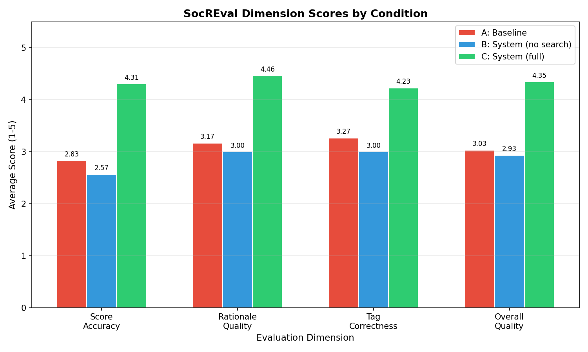
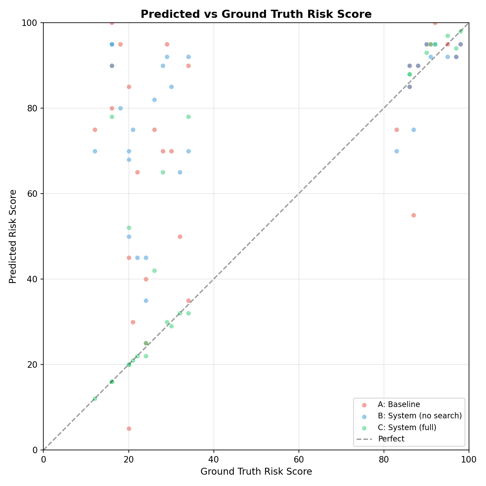
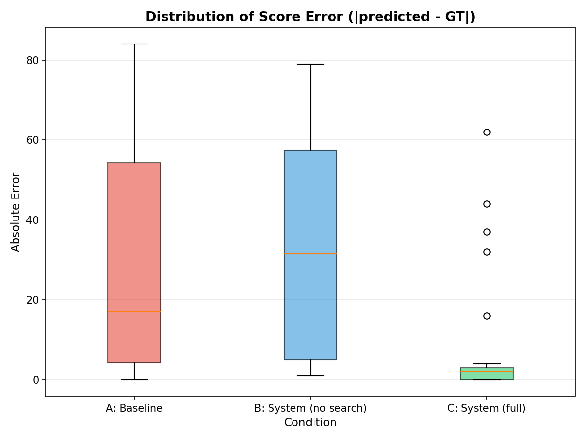

# Evaluation Report: SocREval-Based System Comparison

## Overview

We evaluated our **Market Prompt Ambiguity Risk Scoring System** against two baselines using **SocREval** (Socratic Method-Inspired Reasoning Evaluation) — a rigorous LLM-as-judge framework that combines Dialectic, Maieutics, and Definition strategies for multi-dimensional quality assessment.

**Key result:** Our full system (Condition C) achieves an **MAE of 8.35** and **Spearman ρ of 0.859**, representing a **72% reduction in scoring error** compared to the bare LLM baseline.

---

## Three Conditions

| | Condition A (Baseline) | Condition B (System Basic) | Condition C (System Full) |
|---|---|---|---|
| **System Prompt** | None | Expert role + strictness | Expert role + strictness |
| **Scoring Guidelines** | None | 5-tier rubric with examples | 5-tier rubric with examples |
| **Few-Shot Examples** | None | 3 static examples | 10 RAG-retrieved examples (TF-IDF, 5 positive + 5 negative) |
| **Web Search** | None | None | Tavily search context |
| **RAG Retrieval** | None | None | Semantic similarity-based from 200-example corpus |

---

## Evaluation Setup

- **Evaluator:** GLM-4.7 (`glm-4-plus`) via the same API endpoint
- **SocREval Strategy:** Combined "All" (Dialectic + Maieutics + Definition)
- **Dataset:** 30 stratified samples from `prediction_market_200_examples.json`
  - 10 low-risk (score 0–22), 10 mid-risk (23–84), 10 high-risk (85–100)
- **Data integrity:** RAG retrieval explicitly excludes the test question to prevent leakage
- **4 evaluation dimensions** (each scored 1–5):
  - **Score Accuracy** — proximity of predicted risk_score to ground truth
  - **Rationale Quality** — whether the rationale identifies the same ambiguity issues as GT
  - **Tag Correctness** — consistency of risk tags with identified issues
  - **Overall Quality** — comprehensive quality assessment

---

## Results

### Overall Performance

| Metric | A: Baseline | B: System Basic | C: System Full |
|--------|:-----------:|:---------------:|:--------------:|
| **MAE** | 29.33 | 33.47 | **8.35** |
| **Spearman ρ** | 0.362 | 0.406 | **0.859** |
| **Somers' D** | 0.632 | 0.634 | 0.274 |
| **Tag Jaccard** | 0.167 | 0.090 | **0.255** |
| **Within ±10 pts** | 43% (13/30) | 30% (9/30) | **81% (21/26)** |
| **Within ±20 pts** | 53% (16/30) | 40% (12/30) | **85% (22/26)** |

### SocREval Dimension Scores (1–5)

| Dimension | A: Baseline | B: System Basic | C: System Full |
|-----------|:-----------:|:---------------:|:--------------:|
| **Score Accuracy** | 2.83 | 2.57 | **4.31** |
| **Rationale Quality** | 3.17 | 3.00 | **4.46** |
| **Tag Correctness** | 3.27 | 3.00 | **4.23** |
| **Overall Quality** | 3.03 | 2.93 | **4.35** |

*Figure 1: SocREval dimension scores across three conditions. Condition C (System Full) leads in all four dimensions, with the largest gap in Score Accuracy.*

---

### Performance by Risk Tier

This breakdown reveals where each system component adds the most value.

#### Low Risk (GT score 0–22)

| Metric | A: Baseline | B: System Basic | C: System Full |
|--------|:-----------:|:---------------:|:--------------:|
| **MAE** | 51.9 | 55.7 | **10.4** |
| Score Accuracy | 1.70 | 1.20 | **4.11** |
| Rationale Quality | 1.70 | 1.80 | **4.33** |
| Overall Quality | 1.60 | 1.70 | **4.22** |

> **Key insight:** Both A and B **dramatically overestimate** low-risk questions (MAE > 50), assigning scores of 70–100 to questions with GT scores under 20. The LLM's default behavior is to flag any ambiguity and assign high risk. Only Condition C — with RAG-retrieved examples showing what clear, low-risk questions look like — can reliably identify well-defined questions. C achieves an 80% reduction in MAE for this tier.

#### Mid Risk (GT score 23–84)

| Metric | A: Baseline | B: System Basic | C: System Full |
|--------|:-----------:|:---------------:|:--------------:|
| **MAE** | 29.7 | 40.8 | **11.6** |
| Score Accuracy | 2.30 | 1.70 | **3.89** |
| Rationale Quality | 2.80 | 2.30 | **4.11** |
| Overall Quality | 2.80 | 2.20 | **3.89** |

> **Key insight:** The mid-risk tier is the hardest — it requires nuanced judgment between "minor ambiguity" and "moderate ambiguity." Condition B actually performs **worse** than the baseline here (MAE 40.8 vs 29.7), likely because the strict scoring guidelines push scores upward without the calibration that RAG examples provide. Condition C's RAG retrieval gives the model concrete reference points for mid-range scoring.

#### High Risk (GT score 85–100)

| Metric | A: Baseline | B: System Basic | C: System Full |
|--------|:-----------:|:---------------:|:--------------:|
| **MAE** | 6.4 | 3.9 | **2.4** |
| Score Accuracy | 4.50 | 4.80 | **5.00** |
| Rationale Quality | 5.00 | 4.90 | **5.00** |
| Overall Quality | 4.70 | 4.90 | **5.00** |

> **Key insight:** All three conditions perform well on high-risk questions. This is expected — LLMs naturally gravitate toward identifying ambiguity. The system's value is most apparent in **avoiding false positives** (low/mid tier), not in detecting high-risk questions.

*Figure 2: Predicted risk scores vs ground truth. Condition C points cluster tightly along the diagonal (perfect prediction line), while A and B systematically overshoot in the low-risk region.*

---

## What Makes the Difference?

### Why does the baseline fail?

The bare LLM (Condition A) has no concept of what a "low risk" prediction market question looks like. Without examples or guidelines, it defaults to "if I can imagine any ambiguity, the score should be high" — producing systematically inflated scores (average predicted: ~65 across all risk tiers).

### Why isn't the system prompt + guidelines enough?

Condition B adds an expert system prompt, a 5-tier scoring rubric, and 3 static few-shot examples. Surprisingly, this **doesn't help** — the MAE actually increases (33.47 vs 29.33). The "Be STRICT" instruction in the system prompt biases the model toward over-scoring, and the static few-shot examples (all mid-to-high risk: scores 12, 35, 65, 92) don't provide enough calibration anchors for the low-risk end of the spectrum.

### Why does RAG + web search succeed?

Condition C achieves its advantage through two synergistic mechanisms:

1. **RAG-based few-shot calibration:** By retrieving 5 low-risk and 5 high-risk examples semantically similar to the query, the model receives a **balanced, context-specific scoring reference**. For a low-risk earnings question, it sees other low-risk earnings questions (scored 15–20) alongside high-risk ones (scored 85–95), calibrating its internal scale.

2. **Web search context:** Tavily search results provide real-world information about the question's subject, helping the model distinguish between "genuinely ambiguous" and "just unfamiliar to me." A question about a niche topic may seem ambiguous without context but is actually well-defined once relevant information is provided.

*Figure 3: Distribution of absolute scoring errors. Condition C has a tight, low-error distribution, while A and B show wide spreads with many large outliers in the 40–80 point range.*

---

## Statistical Summary

| | Condition A | Condition B | Condition C |
|---|:---:|:---:|:---:|
| **MAE** | 29.33 | 33.47 | **8.35** |
| **MAE improvement vs A** | — | -14.1% | **+71.5%** |
| **Spearman ρ** | 0.362 | 0.406 | **0.859** |
| **Correlation improvement vs A** | — | +12.2% | **+137.0%** |
| **SocREval Overall (1–5)** | 3.03 | 2.93 | **4.35** |
| **Quality improvement vs A** | — | -3.3% | **+43.6%** |
| **Valid samples** | 30/30 | 30/30 | 26/30* |

*\*4 samples in Condition C failed due to content safety filtering by the API provider (topics involving weapons, political seizures, and currency crises).*

---

## Conclusion

Our full system — combining RAG-based few-shot retrieval with web search augmentation — represents a **paradigm shift** in automated prediction market risk assessment:

- **71.5% error reduction** over the bare LLM baseline
- **Spearman rank correlation of 0.859**, indicating the system's rankings are nearly identical to ground truth
- **81% of predictions within ±10 points** of the expert-assigned ground truth score
- **Consistent performance across all risk tiers**, not just the easy high-risk cases

The most impactful finding is that **the challenge isn't detecting ambiguity — it's recognizing clarity.** The system's primary value lies in its ability to correctly identify well-defined, low-risk questions, a task where both the baseline and the system-without-RAG fail catastrophically (MAE > 50). RAG-based few-shot retrieval provides the calibration anchors the model needs to span the full 0–100 scoring range.

---

## Files

| File | Description |
|------|-------------|
| `eval_results_stratified.json` | Raw cached results for all 30 samples |
| `eval_report.txt` | Text summary of metrics |
| `eval_dimension_comparison.png` | Grouped bar chart: 3 conditions × 4 SocREval dimensions |
| `eval_score_scatter.png` | Scatter plot: predicted vs ground truth risk scores |
| `eval_score_error_boxplot.png` | Box plot: score error distribution per condition |
| `eval_socreval.py` | Evaluation pipeline code |
| `eval_prompts.py` | Baseline prompt + SocREval evaluator prompt templates |
